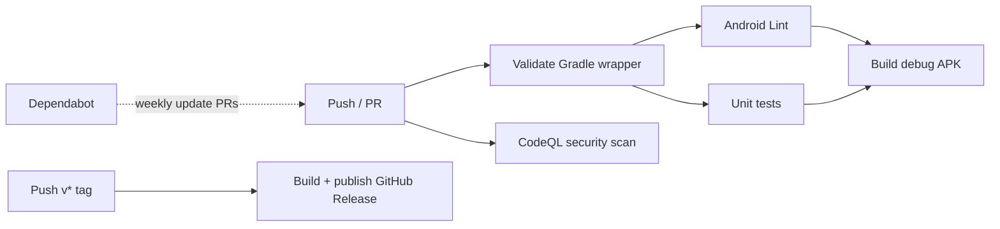

# Sandbox Shop

[](https://github.com/bugbee-ai/sandbox-shop/actions/workflows/ci.yml)
[](https://github.com/bugbee-ai/sandbox-shop/actions/workflows/codeql.yml)
[](https://github.com/bugbee-ai/sandbox-shop/releases/latest)
[](LICENSE)

A minimal Android (Kotlin) checkout app that doubles as a **working showcase of
the GitHub ecosystem for mobile teams**. Every push is linted, tested, built,
and security-scanned; releases publish an installable APK automatically; and
the team workflow (issues → branches → PRs → protected `main`) is fully wired
up. iOS teams: every concept here maps one-to-one — swap the Ubuntu runners
for macOS runners and Gradle for Xcode/fastlane.

## The pipeline



## What's wired up

| GitHub feature | Where to look |
|---|---|
| **Actions CI** — lint, unit tests, APK build on every push/PR | [`ci.yml`](.github/workflows/ci.yml) · [Actions tab](https://github.com/bugbee-ai/sandbox-shop/actions) |
| **Release automation** — `v*` tag → GitHub Release + APK asset | [`release.yml`](.github/workflows/release.yml) · [Releases](https://github.com/bugbee-ai/sandbox-shop/releases) |
| **CodeQL code scanning** — push, PR, and weekly | [`codeql.yml`](.github/workflows/codeql.yml) · Security tab |
| **Dependabot** — alerts + weekly update PRs for Gradle and Actions | [`dependabot.yml`](.github/dependabot.yml) |
| **Secret scanning + push protection** | Repo settings → Code security |
| **Branch ruleset** — `main` requires a PR with green CI | Settings → Rules |
| **Issue forms, PR template, CODEOWNERS** | [`.github/`](.github/) |
| **GitHub Pages** — project site deployed by Actions | [`pages.yml`](.github/workflows/pages.yml) · [Site](https://bugbee-ai.github.io/sandbox-shop/) |
| **Environments** — releases deploy against `production` | Deployments tab |

## Build it yourself

```sh
git clone https://github.com/bugbee-ai/sandbox-shop.git
cd sandbox-shop
./gradlew assembleDebug          # APK lands in app/build/outputs/apk/debug/
./gradlew testDebugUnitTest      # run the unit tests
```

Or skip the local toolchain entirely: grab the APK from the
[latest release](https://github.com/bugbee-ai/sandbox-shop/releases/latest)
or from any CI run's artifacts.

> **Heads up:** the checkout flow contains an intentional bug
> (`BUGBEE-DEMO-BUG` in `MainActivity.kt`) used by Bugbee's automated
> bug-triage demos. It's a feature, not a bug… well, it's both.

## Contributing

See [CONTRIBUTING.md](CONTRIBUTING.md) for the full workflow, and
[SECURITY.md](SECURITY.md) for how to report vulnerabilities.
